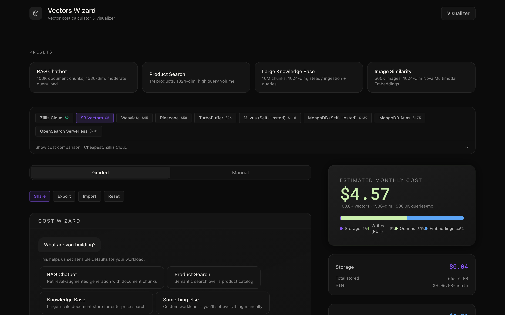
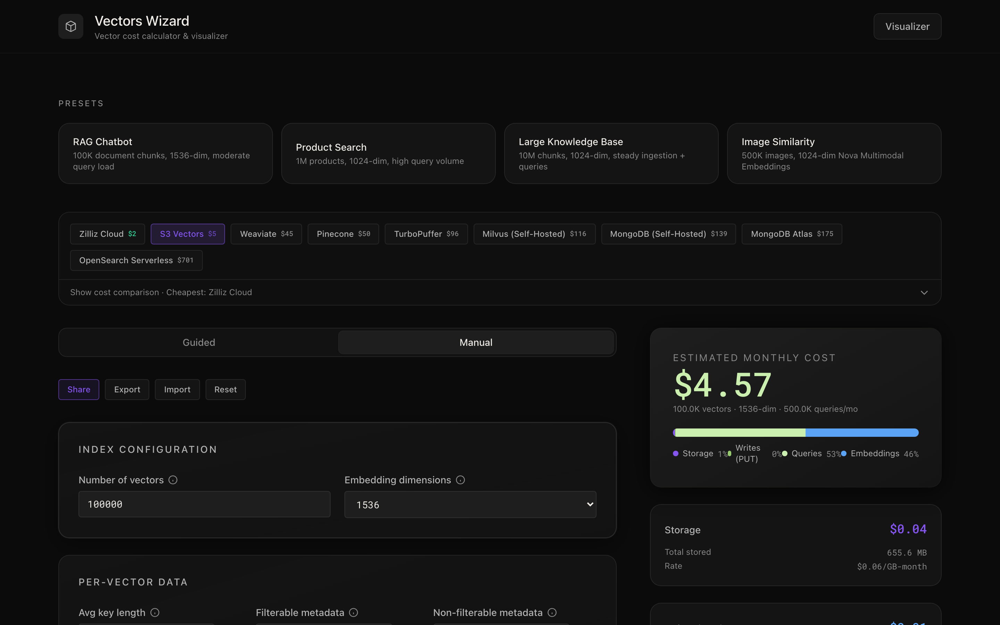
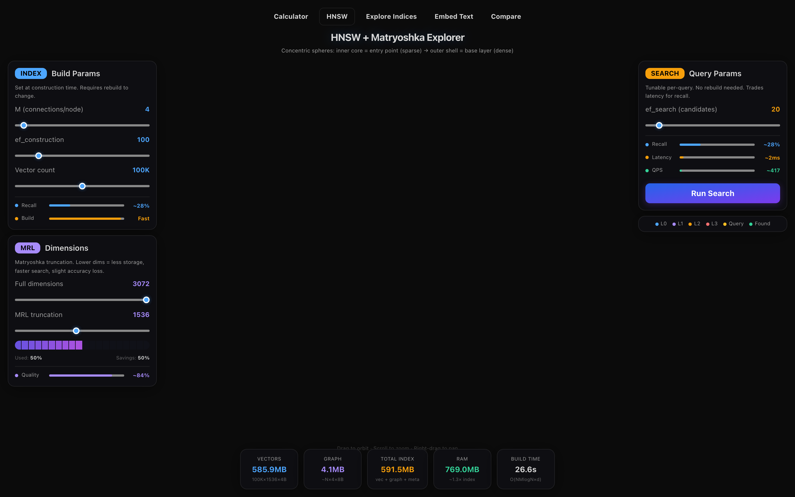

# Vectors Wizard

Compare monthly costs across 9 vector database providers. Built by [Caylent](https://caylent.com).

**Live demo**: [vectors-wizard.caylent.tech](https://vectors-wizard.caylent.tech)


## Supported Providers

| Provider | Pricing Model |
|----------|--------------|
| Amazon S3 Vectors | Storage + PUT + query API + tiered query data |
| Amazon OpenSearch Serverless | OCU-hours + S3 storage |
| Pinecone | Pods/serverless, storage + compute |
| Weaviate Cloud | Per-dimension pricing + SLA tiers |
| Zilliz Cloud | CU-based compute + storage |
| TurboPuffer | Storage + read/write GB + plan minimums |
| MongoDB Atlas | Flex/Dedicated cluster tiers |
| MongoDB on EC2 | EC2 instances + EBS storage |
| Milvus on EC2 | EC2 instances + EBS storage |

## Features

- **Guided Wizard** — chatbot-style questionnaire that walks through use case, embedding model, and workload parameters

  

- **Manual Configurator** — direct control over all pricing inputs with real-time cost breakdown

  

- **Cross-Provider Comparison** — side-by-side cost comparison across all 9 providers with the same workload

  

- **Quickstart Presets** — pre-configured templates for common use cases (RAG chatbot, product search, knowledge base, image similarity)
- **Shareable Links** — URL-encoded state for sharing configurations
- **Import/Export** — save and load configurations as JSON
- **3D Visualizer** — interactive Three.js visualizations of HNSW and IVF index algorithms

  

## Quick Start

```bash
npm install
npm run dev
```

Open [http://localhost:3000](http://localhost:3000)

## Architecture

Built with Next.js 16, React 19, and Tailwind CSS. No external state management libraries.

### Provider System

The core is a pluggable provider abstraction in `src/lib/providers/`. Each provider implements `PricingProvider<TConfig>` and defines:

- **Pricing logic** — rates and cost calculation (`pricing.ts`)
- **Config fields** — UI form definition (`index.ts`)
- **Wizard steps** — guided questionnaire flow (`wizard-steps.ts`)
- **Presets** — example configurations (`presets.ts`)
- **Cross-provider translation** — `toUniversalConfig` / `fromUniversalConfig` for comparison

### State Management

Two custom hooks manage all state:

- `useCalculator` — config, mode switching (landing/wizard/configurator), cost computation via `useMemo`
- `useWizard` — conversation flow, step tracking, branching logic, config patching

### Visualizer

Interactive 3D visualizations at `/visualizer` using `@react-three/fiber`:

- **HNSW** — hierarchical navigable small world graph with animated search traversal
- **IVF** — inverted file index with centroid-based nearest neighbor search

## Scripts

```bash
npm run dev      # Development server
npm run build    # Production build
npm run lint     # ESLint
npm test         # Run tests (vitest)
```

## License

[MIT](LICENSE)
